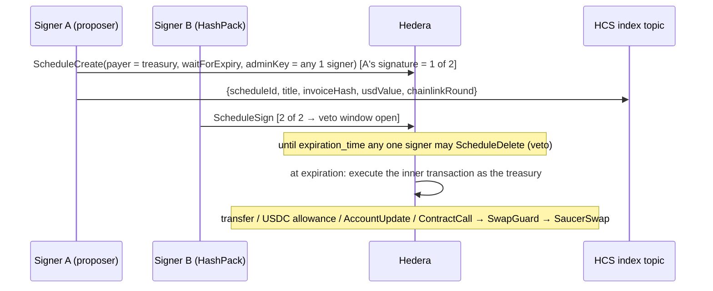

# Quorum Treasury — a native Hedera team treasury (Scaffold-HBAR template)

> Your startup just got a grant. **Large payments need 2 of 3 founders and then wait out a veto window before they run. Day-to-day spending comes from a USDC budget that the network itself caps. Treasury swaps the template proposes go through a guard that demands the Chainlink price.** There is no multisig contract: it is Hedera threshold keys, scheduled transactions and allowances, plus SaucerSwap and Chainlink where money changes hands.

```bash
npm create scaffold-hbar@latest -- --template Nicolas6879/scaffold-hbar-quorum-treasury
```

Every funded team ends up rebuilding the same plumbing: a shared account nobody can drain alone, a way to approve payments asynchronously, a budget for small expenses, and a log investors can audit. On EVM chains teams reach for Safe. On Hedera the ledger already has the primitives — this template wires them into something a team can use on day one and a developer can extend in an afternoon.

| | |
|---|---|
| **Look first, no account needed** | `yarn next:dev` → open http://localhost:3000. The dashboard reads our public testnet treasury. |
| **Proof it runs on testnet** | [`docs/TESTNET_PROOF.md`](docs/TESTNET_PROOF.md) — every claim has a HashScan link and a mirror-node query; `yarn verify:proofs` re-checks them all. |
| **How it works** | [`docs/ARCHITECTURE.md`](docs/ARCHITECTURE.md) · design choices and trade-offs in [`docs/DECISIONS.md`](docs/DECISIONS.md) |
| **Make it yours** | [`docs/CUSTOMIZE.md`](docs/CUSTOMIZE.md) — change M-of-N, add a proposal type, point at mainnet |
| **Coding agents** | [`AGENTS.md`](AGENTS.md) |

## What you get

| Need | How the template does it | Enforced by |
|---|---|---|
| No single person can move treasury funds | Treasury account key = **2-of-3 `KeyList`** (ED25519 and ECDSA keys can be mixed) | Hedera network |
| Approve payments asynchronously | Each proposal is a **`ScheduleCreate`** paid by the treasury; every signer submits their own `ScheduleSign` from HashPack (or a script) | Hedera network |
| Time to object | **`waitForExpiry`** (HIP-423): an approved proposal waits until its expiration time before executing | Hedera network |
| Stop a bad payment | **Minority veto**: the schedule admin key is 1-of-3, so any one signer can `ScheduleDelete` during the window | Hedera network |
| Small expenses without a meeting | The quorum approves a **USDC allowance** (HIP-336) to an ops account any one signer controls; spending past it fails with `AMOUNT_EXCEEDS_ALLOWANCE` | Hedera network |
| Swap treasury HBAR to USD safely | **`SwapGuard.sol`** checks Chainlink HBAR/USD (fresh, positive), refuses a SaucerSwap V1 pool more than 3 % from it, derives `amountOutMin` on-chain and sends output only to the caller | `SwapGuard` contract |
| Route spends by USD value | `@sh/treasury` values each spend with **Chainlink** and decides ops budget vs quorum vs long veto window | This template (off-chain) |
| A log people can audit | Proposals are announced on an **HCS topic** (submit key = any one signer) with title, invoice hash and the Chainlink round used; the UI reconciles it with the ledger | Hedera network + UI |
| Rotate a signer | Scheduled `AccountUpdate` with a new threshold key (needs 2 old signatures **and** the new key) | Hedera network |
| Know what you are signing | HashPack shows only "ScheduleSign"; the UI decodes the scheduled body (and the SwapGuard call) before you sign | This template |

**Hedera services:** threshold keys, Scheduled Transactions (HIP-423 long-term schedules), HTS (USDC, allowances, auto-association), HCS, smart contracts, mirror node. **Ecosystem:** SaucerSwap V1 RouterV3, Chainlink HBAR/USD, HashPack via `@hashgraph/hedera-wallet-connect`.

## Run your own treasury on testnet (5 commands)

Prerequisites: Node ≥ 20.18.3, Yarn (via `corepack enable`) or npm, [Foundry](https://getfoundry.sh) **v1.7.1** (`foundryup -i v1.7.1`; forge ≥ 1.8 breaks deploys through the Hashio relay), and one funded testnet account from [portal.hedera.com](https://portal.hedera.com).

```bash
cp .env.example .env.local             # put OPERATOR_ID and OPERATOR_KEY in .env.local (gitignored)
yarn treasury:setup                    # 2-of-3 treasury, ops account, signer keys, HCS index, USDC association
yarn treasury:propose -- --type hbar --to 0.0.98 --amount 1 --timelock 120
yarn treasury:sign -- --schedule <id printed above> --as 3
yarn next:dev                          # watch it go: collecting → veto window → executed
```

`treasury:setup` uses **one** account: it generates the three signer keys, stores them in `.env.local` and funds the new accounts. Set `SIGNER1_PUBLIC_KEY` to your HashPack account's public key first if you want to be signer 1 and sign in the browser. Re-running it is safe: it resumes from `deployments/testnet.json`.

| Variable | Required | What it is |
|---|---|---|
| `OPERATOR_ID`, `OPERATOR_KEY` | for scripts | Funded testnet account that pays for setup. ECDSA keys from the portal work as-is; set `OPERATOR_KEY_TYPE=ED25519` for raw ED25519 hex. |
| `SIGNER1_PUBLIC_KEY` | no | Make your HashPack account signer 1 |
| `NEXT_PUBLIC_WALLET_CONNECT_PROJECT_ID` | for browser signing | Free at [dashboard.walletconnect.com](https://dashboard.walletconnect.com). Without it the UI is read-only and tells you the CLI command instead. |
| `NEXT_PUBLIC_TREASURY_ID` | no | Point the dashboard at another treasury without editing files |
| `TREASURY_INITIAL_HBAR`, `OPS_INITIAL_HBAR` | no | Funding for new accounts (default 40 and 5) |

### Scripts

| Command | What it does |
|---|---|
| `yarn treasury:setup` | Create or resume the treasury |
| `yarn treasury:propose -- --type hbar\|usdc\|budget\|swap ...` | Create a proposal (signer 2 by default; `--as 3`), announce it on HCS |
| `yarn treasury:sign -- --schedule 0.0.x --as 3` | Approve; prints the decoded proposal first |
| `yarn treasury:veto -- --schedule 0.0.x --as 1` | Veto during the timelock |
| `yarn treasury:demo -- --step all` | Re-create every proof in `docs/proofs.json` |
| `yarn verify:proofs` | Check every recorded proof against the public mirror node (no keys) |
| `yarn test` | Treasury library (vitest, incl. property tests) + SwapGuard (unit, fuzz, invariant) |
| `yarn foundry:deploy --network hedera_testnet` | Deploy your own SwapGuard |

## How a proposal flows



## Limitations (read before you trust it with money)

- **Testnet demo signers.** In the recorded proofs two signers are script keys on one machine; proofs signed from HashPack are labelled as such. On HashScan a wallet signature and a script signature look the same, so `signedBy` in `docs/proofs.json` is a declaration, not something the ledger proves.
- **The routing policy is off-chain.** The network enforces the threshold key, the timelock, the veto, the allowance cap and SwapGuard. Deciding that a $200 spend goes to the ops budget and a $20k spend gets a 7-day window lives in `@sh/treasury`; a team that bypasses the UI can still propose anything to the quorum (and the quorum can still call SaucerSwap directly, without SwapGuard).
- **The budget does not reset.** An HTS allowance is a cumulative cap. "Monthly budget" means proposing a new allowance each month.
- **Testnet swap pool.** The only SaucerSwap V1 WHBAR/USDC pool on testnet is priced ~22× away from Chainlink, so SwapGuard (correctly) refuses it — that refusal is proof #1. The executed-swap proof uses a WHBAR/**tUSD** pool the demo seeds at the Chainlink price; tUSD is a testnet-only stand-in for USDC. On mainnet you point SwapGuard at the real USDC pool.
- **SwapGuard assumes the stablecoin is worth $1.** It compares the pool to HBAR/USD, not to a USDC/USD feed.
- **The index shows what the template announced.** A schedule created outside the template does not appear on `/audit`.
- **HashPack signs blind.** Wallets show "ScheduleSign" without the inner transaction; the UI's decoded view is your check. Unknown transaction types are shown as "do not sign unless you know what it is".
- Not audited. Testnet only by default.

## Project layout

```
packages/foundry    SwapGuard.sol + tests (unit, fuzz, invariant, opt-in fork test against testnet)
packages/treasury   @sh/treasury: proposal builders, decoder, lifecycle, keys, policy, mirror client, HCS index; CLI scripts
packages/nextjs     Dashboard: /, /proposals, /proposals/[id], /new, /budget, /audit, /debug
deployments/        Public ids of the demo treasury (no secrets)
docs/               Architecture, decisions, customization, testnet proofs
```

## Troubleshooting

| Symptom | Fix |
|---|---|
| `NO_NEW_VALID_SIGNATURES` | That key already signed, or it is not one of the treasury's keys. |
| `IDENTICAL_SCHEDULE_ALREADY_CREATED` | Same proposal twice; sign the existing one (the scripts add a nonce to the memo to avoid this). |
| Proposal stuck in "Executing" | Execution after expiry is lazy: the network runs it on a later transaction. Testnet traffic usually does it within seconds. |
| `SCHEDULE_EXPIRY_IS_BUSY` | Too many schedules expire in that second; retried automatically with jitter. |
| `CONTRACT_REVERT_EXECUTED` on a swap | Usually `PoolPriceOutOfBand` or `StalePrice` from SwapGuard — check the decoded revert on HashScan. |
| Foundry deploy fails with an RPC error | Use forge v1.7.1 (`foundryup -i v1.7.1`). |
| `create-scaffold-hbar` picked the wrong framework | Pass flags explicitly: `npx create-scaffold-hbar@latest app --template Nicolas6879/scaffold-hbar-quorum-treasury -s foundry --package-manager yarn`. |

## License

MIT. Built on the Scaffold-HBAR blank template (© BuidlGuidl, hedera-dev); see [`LICENCE`](LICENCE).
